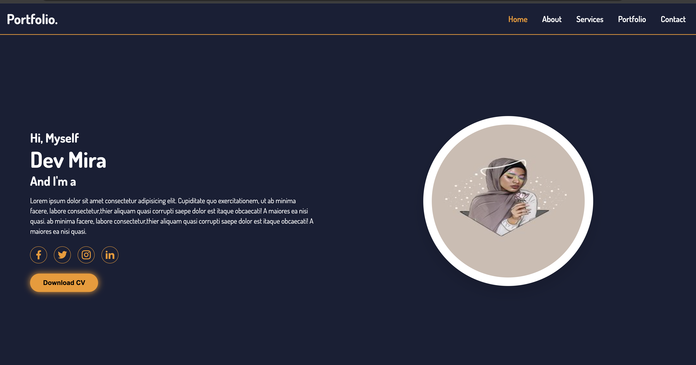
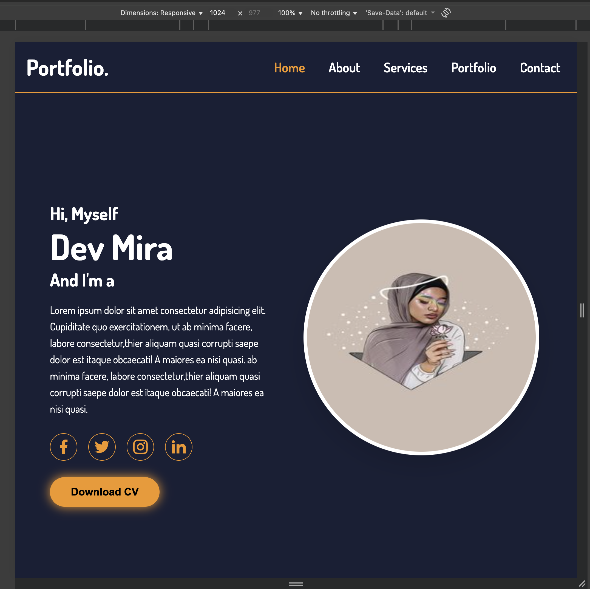
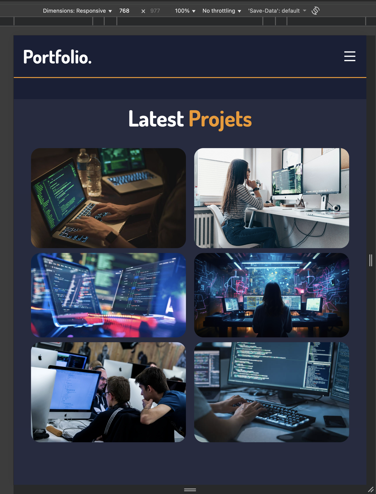
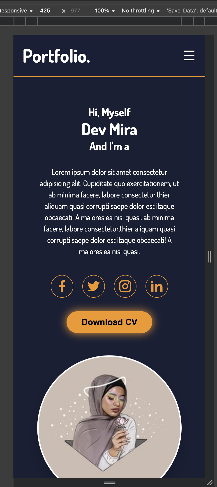
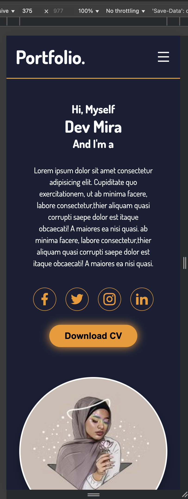
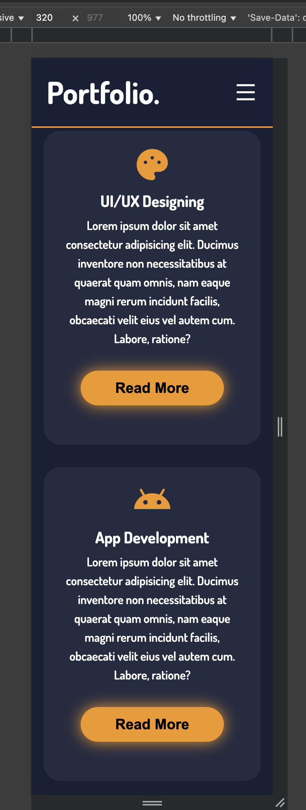

# Portfolio
## Ceci est mon projet de portfolio personnel réalisé avec HTML et CSS.  
Le site présente des informations.

## Contenu du site

 Accueil  
 À propos  
 Services  
 Portfolio  
Contact

## Outils

HTML
CSS
Il est responsive  donc il s’adapte à tous les écrans.

##  Découvertes et apprentissages

Pendant la création de ce projet, j’ai beaucoup appris sur :  
Les transitions CSS pour rendre les effets plus doux.  
Les animations, comme le mouvement d’une image ou d’un texte.  
 Les effets hover, qui rendent le site plus interactif. 
 ## Remarques personnelles
 une fois  de plus ce nouveau projet marque  une étape importante dans mon apprentissage du front-end.

 ## les captures d'ecrans
 - pour le doc:
 

 - pour 1024px:
 

 - pour 768px:
 

 -pour 425px:
 
 - pour 375px:
 

 - pour 320px:
 

